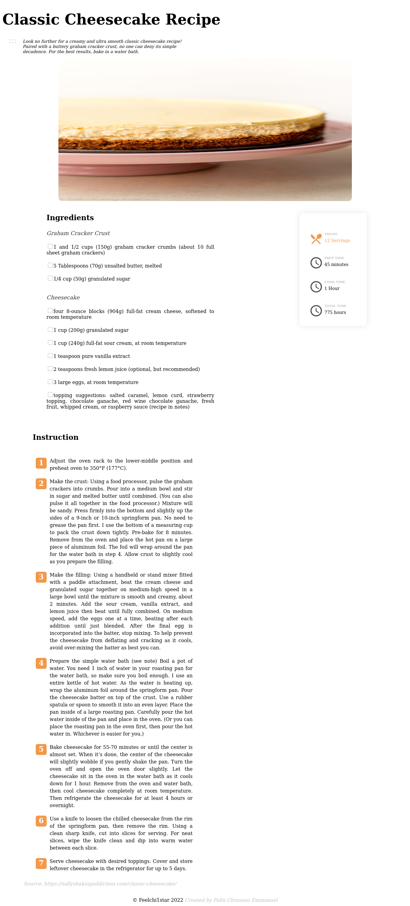
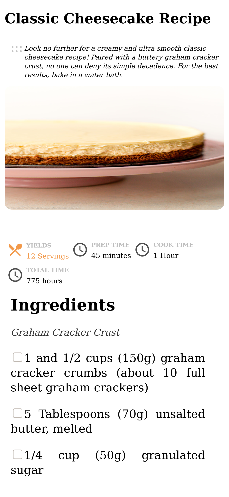
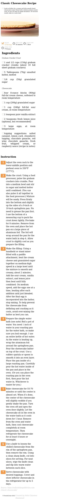

# Recipe-page

The recipe Blog Challenge | Devchallenge

   Solution for a challenge from  <a href="http://devchallenges.io" target="_blank">Devchallenges.io</a>.

  <h3>
    <a href="https://feel-recipe.netlify.app/">
      Demo
    </a>
     | 
    <a href="https://github.com/feelchi1star/Recipe-page.git">
      Solution
    </a>
     | 
    <a href="https://devchallenges.io/challenges/OEKdUZ6xs0h99C38XVht">
      Challenge
    </a>
  </h3>

## Table of Contents

- [Overview](#overview)
  - [Built With](#built-with)
- [Features](#features)
- [Contact](#contact)
- [Acknowledgements](#acknowledgements)

## Overview

### Desktop View

### Table View

### Mobile View

- Where can I see your demo?
  You see my demo at -[RECIPE PAGE CHALLENGE](https://feel-recipe.netlify.app/)
- What was your experience?
  My exprience was really intermediate.
- What have you learned/improved?
  I really improved on my knowledge on Media Query to target different devices with breakpoints.

### Built With

- [HTML](https://html.org/)
- [CSS](https://w3.org/)
- [Javascript](https://javascript.com/)
